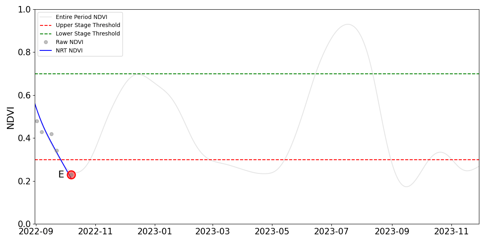
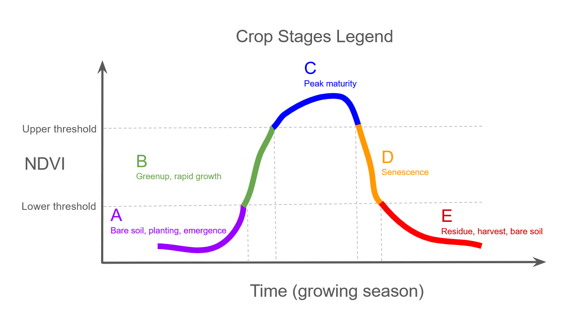

# Crop Stage Detection

A crop-agnostic model for estimating the crop stage from an NDVI time series — no crop-specific calibration needed.



[](https://colab.research.google.com/github/nasaharvest/crop-stage-detection/blob/main/examples/01_byod.ipynb)

## How it works

Most row crops and vegetables follow the same characteristic NDVI trajectory
over a growing season: a rise from bare soil through rapid greenup to peak
vegetative vigor, followed by senescence and harvest. The duration, steepness,
and peak height vary by crop, region, and season — but the shape is consistent
enough that a single curve-relative model can locate "where on the curve" a
given observation falls, without knowing which crop it is.



The curve is divided into five generic stages:

| Stage | Name | Description |
|-------|------|-------------|
| **A** | Bare soil / emergence | NDVI below lower threshold, no prior peak |
| **B** | Greenup / rapid growth | NDVI in mid-range and rising |
| **C** | Peak maturity | NDVI at or above upper threshold |
| **D** | Senescence | NDVI in mid-range and falling, peak confirmed |
| **E** | Post-harvest / residue | NDVI below lower threshold, peak confirmed |

**How the model works:**

1. **Input** — the model takes a raw NDVI time series as input. NDVI can be fetched from Google Earth Engine (GEE) for GEE users, or you can bring your own data if you already have an NDVI time series.
2. **Preprocessing** — raw observations (typically irregularly spaced) are resampled to a daily grid, gap-filled using PCHIP interpolation, and then smoothed with a Whittaker filter to reduce noise while preserving the seasonal curve shape.
3. **Stage assignment** — the stage of the last observation is determined by three signals: (1) where the current NDVI falls relative to an adaptive upper threshold (90th percentile of the series) and a fixed lower threshold, (2) the direction of change (rising or falling), estimated via a Kalman filter, and (3) whether a confirmed seasonal peak has already occurred in the series.

## Installation

Requires Python 3.9+.

```bash
git clone https://github.com/nasaharvest/crop-stage-detection.git
cd crop-stage-detection
pip install -r requirements.txt
```

For the GEE workflow only (`src/gee_fetch.py`):

```bash
pip install -r requirements-gee.txt
earthengine authenticate
```

For GEE authentication, see the [Earth Engine authentication guide](https://developers.google.com/earth-engine/guides/auth).

To verify the installation:

```bash
python test_basic.py
```

## Quick start — Bring Your Own Data (no GEE)

```python
import sys
sys.path.insert(0, "src")

import pandas as pd
from crop_stage import run_crop_stage_from_dataframe

df = pd.read_csv("sample_data/sample_ndvi.csv", parse_dates=["date"])
result = run_crop_stage_from_dataframe(df)
print(result["Stage"], "—", result["Stage_description"])
```

**Input format** — your DataFrame needs at minimum:

| Column | Type | Notes |
|--------|------|-------|
| `date` | datetime | Any parseable format, irregular spacing is fine |
| `NDVI` | float [0–1] | Cloud-free observations only |

The sample CSV also contains `sensor` and `field_id` columns — these are ignored in single-field mode and used only in the multi-field batch example.

## Quick start — GEE fetch

```python
import sys
sys.path.insert(0, "src")

import ee
ee.Initialize()   # must come first

from gee_fetch import fetch_ndvi
from crop_stage import smooth_daily_interpolate_ndvi, estimate_stage_adaptive

ndvi_df = fetch_ndvi(
    "my_field.geojson",
    start_date="2023-03-01",
    end_date="2023-11-30",
)
df_smooth = smooth_daily_interpolate_ndvi(ndvi_df)
result = estimate_stage_adaptive(
    df_smooth["NDVI_smooth"].to_numpy(),
    dates=df_smooth["date"],
)
print(result["Stage"], "—", result["Stage_description"])
if result.get("Peak_date"):
    print(f"Peak: {result['Peak_date'].date()}  |  Days since peak: {result['Days_since_peak']}")
```

## Batch — many fields at once

```python
# BYOD — df contains multiple fields, each identified by a field_id column
from crop_stage import run_crop_stage_from_dataframe
results = run_crop_stage_from_dataframe(df, id_col="field_id")
# returns a DataFrame with one row per field

# GEE
from gee_fetch import run_crop_stage_from_gee
results = run_crop_stage_from_gee(gdf, id_col="field_id", lookback_days=180)
```

## Project structure

```
crop-stage-detection/
├── src/
│   ├── crop_stage.py       Core model (no GEE dependency)
│   └── gee_fetch.py        Optional GEE layer
├── examples/
│   ├── 01_byod.ipynb       BYOD walkthrough with visualisation
│   └── 02_gee.ipynb        Full GEE pipeline
├── sample_data/
│   └── sample_ndvi.csv     One field × one season (works out of the box)
├── docs/
│   ├── crop_stages_legend.png
│   └── crop_stage_detection.gif
├── requirements.txt        Core dependencies (BYOD)
├── requirements-gee.txt    Additional dependencies for GEE workflow
├── CITATION.cff
├── LICENSE
└── test_basic.py           Smoke test — run after install to verify
```

## Output fields

`estimate_stage_adaptive` returns a dict with:

| Key | Type | Description |
|-----|------|-------------|
| `Stage` | str | Stage label: A, B, C, D, E, or "Insufficient Data" |
| `Stage_description` | str | Human-readable stage name |
| `Value` | float | NDVI at the last observation |
| `Velocity` | float or None | Kalman-estimated rate of change (NDVI/day); None for stage C |
| `Last_date` | Timestamp | Date of the last observation |
| `Peak_date` | Timestamp | Date of the detected seasonal peak (or None) |
| `Days_since_peak` | int | Days elapsed since peak (or None) |
| `Upper_threshold` | float | Adaptive upper threshold used |
| `Lower_threshold` | float | Fixed lower threshold used |

## Key parameters

All thresholds and filter settings are configurable and can be passed directly
to `estimate_stage_adaptive` or `run_crop_stage_from_dataframe`.

| Parameter | Default | Description |
|-----------|---------|-------------|
| `upper_percentile` | 90 | Percentile of the series used as upper threshold |
| `min_peak_ndvi` | 0.50 | Hard floor for the upper threshold |
| `lower_threshold` | 0.35 | Fixed lower threshold |
| `min_peak_width` | 5 | Minimum consecutive days above upper threshold to confirm a peak |
| `min_observations` | 30 | Minimum series length for a reliable estimate |
| `date_col` | `"date"` | Column name for dates in the input DataFrame (``run_crop_stage_from_dataframe``) |
| `ndvi_col` | `"NDVI"` | Column name for NDVI values in the input DataFrame (``run_crop_stage_from_dataframe``) |
| `stage_descriptions` | built-in | Custom ``{label: description}`` dict to rename or translate stage labels |

## License

Apache 2.0 — see [LICENSE](LICENSE).

## Citation

If you use this model in your research, please cite:

```bibtex
@software{pelta2026cropstage,
  author       = {Pelta, Ran},
  title        = {Crop Stage Detection},
  year         = {2026},
  publisher    = {GitHub},
  organization = {NASA Harvest / Agmatix},
  url          = {https://github.com/nasaharvest/crop-stage-detection}
}
```

## Authors

Developed by [Ran Pelta](https://www.linkedin.com/in/ran-pelta) (Agmatix / GrowersTech, NASA Harvest)
